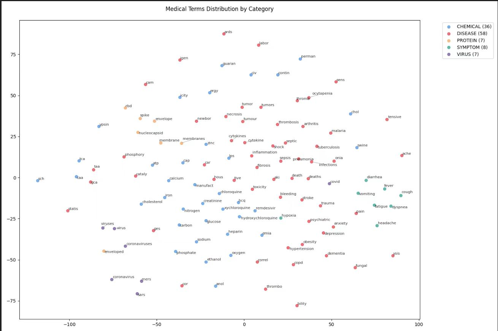

# Report on Natrual Language Processing of Biomedical Essays
### Group 1

MEMBERS: Matteo Frison, Zeng Yiteng, Deng Ziyan, Hu Zijian, Song Zhihang, Yan Jin, Zhao Hengyuan

## Introduction

In this task, we applied Natural Language Processing (NLP) techniques to perform text parsing, tokenization, and word representation learning. We extracted text from raw data and explored multiple tokenization methods, including basic splitting, SciSpaCy tokenization, and Byte Pair Encoding (BPE). After a thorough comparison, we selected our custom BPE model, which demonstrated superior performance in handling out-of-vocabulary and rare words, enhancing semantic representation. 

For word embedding generation, we implemented N-gram Language Modeling, Skip-gram with Negative Sampling, and the Masked Language Model (MLM) based on BERT. The N-gram model produces fixed word embeddings suitable for basic semantic tasks, while Skip-gram, combined with negative sampling, efficiently captures word relationships while maintaining computational efficiency. MLM, on the other hand, generates context-dependent word embeddings but comes with a higher computational cost. Considering both efficiency and semantic quality, we ultimately chose Skip-gram with Negative Sampling.

Finally, we conducted an in-depth analysis of the generated word embeddings and biomedical entities using t-SNE visualization, co-occurrence analysis, and semantic similarity computation to validate their effectiveness in text understanding tasks.

## Method

### Part1 Parse the Data

In accordance with the given requirements, we successfully parsed all JSON files and extracted the full text from the main body of the articles. This process not only ensures data completeness and usability but also effectively preserves the semantic integrity of the original text. Through precise parsing and extraction, we have maintained high data quality, laying a solid foundation for subsequent natural language processing tasks and in-depth analysis.

```bash
Journal Pre-proof Characteristic of Healthcare Workers Infected with COVID-19, a Cross-Sectional Observational Study Characteristic of Healthcare Workers Infected with COVID-19, a Cross-Sectional Observational Study
J o u r n a l P r e -p r o o f 2 Highlights:
Corona Virus Disease 19 (COVID-19) is a newly emerging infectious disease that was first identified in China, December 2020. It is caused by the Severe Acute Respiratory Syndrome Virus (SARS-CoV-2). On 30 th January 2020, the World Health Organization (WHO) declared the disease as a Public Health Emergency of International Concern and later on 11 th March 2020
......
```
In purging the text, we used regex expressions such as `r'\\u[0-9a-fA-F]{4}'` to ensure that there are no non-ascii characters that could possibly affect the outcome of the trained tokenizer.

### Part2 Tokenization

In this section, we explored various tokenization methods, including `split()`, SciSpaCy, and Byte-Pair Encoding (BPE). While the `split()` method is capable of performing basic tokenization, its accuracy declines when dealing with complex texts, especially domain-specific terminology. SciSpaCy offers more precise tokenization for general texts; however, due to the specialized nature of our dataset, many technical terms are not included in its vocabulary, resulting in segmentation errors. Considering the characteristics of our dataset, we ultimately selected BPE as our tokenization approach and constructed a customized Byte-Pair Encoding (BPE) model to further optimize tokenization performance. This method not only enhances the handling of domain-specific terms and out-of-vocabulary words but also ensures more stable and consistent tokenization results for subsequent tasks.

#### Track 2.1

In this track, we implemented a simple text tokenization tool using code. Its main function is to read content from a specified text file and tokenize it based on whether the user chooses to remove punctuation. The tokenized results can be printed to the console or written to a specified file.

The core function `tokenize_text` is designed to tokenize text while effectively removing unwanted characters and punctuation. It provides flexibility in handling non-alphanumeric symbols, ensuring that the tokenized output remains clean and structured. Additionally, the function allows saving the results for further processing.

In summary, we implemented a simple yet effective text tokenization tool using the `split()` function. This tool efficiently cleans raw text by removing noise, enhancing data quality, and making the text more structured. By leveraging regular expressions and string operations, it flexibly handles punctuation removal and allows saving the results for further processing.
```bash
['Journal',
 'Pre',
 'proof',
 'Characteristic',
 'of',
 'Healthcare',
 'Workers',
 'Infected',
 'with',
 'COVID',
 '19',
......
 'between',
 'acquiring',
 'COVID',
 '19',
 'from',
 'the',
 'hospital',
 'and',
 'working',
 'in',
 ...]
```
The tokenization results, as shown above, demonstrate a satisfactory tokenization effect. By using the `split()` method, we successfully segmented the text into meaningful words or subword units. The tokenization results are relatively accurate, effectively handling punctuation and special characters while preserving the semantic information of the text. This lays a solid foundation for subsequent natural language processing tasks.

#### Track 2.2

This process implements a text tokenization tool based on `SpaCy`. Its primary function is to use the `en_core_sci_lg` language model to tokenize input text and return a `SpaCy` document object for further natural language processing tasks.

The core function tokenize_text_spacy takes a single parameter: `text` (the input text to be tokenized). The function first loads the `SpaCy` language model using `spacy.load('en_core_sci_lg')`. It then processes the input text using `nlp(text)` and returns a `SpaCy` document object doc, which contains tokenized results along with syntactic analysis information.

Compared to the `split()` method, which only performs simple segmentation based on spaces or specific characters, `SpaCy` offers more intelligent tokenization. It can accurately handle abbreviations, hyphens, and punctuation while also providing part-of-speech tagging, dependency parsing, named entity recognition, stopword filtering, and lemmatization. Additionally, it supports multiple languages, enabling more effective tokenization.

#### Track 2.3

This process implements a text tokenization tool based on the BPE (Byte Pair Encoding) method. Its main function is to read content from a specified file and tokenize the text using GPT-2’s fast tokenizer `GPT2TokenizerFast`. It is based on Byte Pair Encoding (BPE) and implemented using the `tokenizers` library written in Rust, offering significant speed and memory efficiency advantages. 

The tool primarily consists of the function `BPE_tokenize_file`, which takes three parameters: `input_file` (Path to the input file), `destination` (Directory to save tokenized results), `write_to_file` (Whether to write results to a file, default is False). The function can call the `GPT2TokenizerFast` tokenizer to tokenize multiple input text files into tokens and convert them into token IDs. Based on user preferences, the results can be printed to the console or optionally written to a specified file.

The sample output of the first 100 tokens with token IDs of 100 articles  is shown here.

```bash
Tokenizer initialized.
Tokenizing: 100%|███████████████████████████████████████████████████| 3227/3227 [00:00<00:00, 3459.01it/s]
['00000', '28', 'b', '5', 'cc', '154', 'f', '68', 'b', '8', 'a', '269', 'f', '65', '78', 'f', '21', 'e', '31', 'f', '629', '77', 'Ċ', '"', 'Multi', '-', 'f', 'acet', 'ed', '"', 'ĠCO', 'VID', '-', '19', ':', 'ĠRussian', 'Ġexperience', 'Ċ', 'Ċ', 'According', 'Ġto', 'Ġcurrent', 'Ġlive', 'Ġstatistics', 'Ġat', 'Ġthe', 'Ġtime', 'Ġof', 'Ġediting', 'Ġthis', 'Ġletter', ',', 'ĠRussia', 'Ġhas', 'Ġbeen', 'Ġthe', 'Ġthird', 'Ġcountry', 'Ġin', 'Ġthe', 'Ġworld', 'Ġto', 'Ġbe', 'Ġaffected', 'Ġby', 'ĠCO', 'VID', '-', '19', 'Ġwith', 'Ġboth', 'Ġnew', 'Ġcases', 'Ġand', 'Ġdeath', 'Ġrates', 'Ġrising', '.', 'ĠIt', 'Ġremains', 'Ġin', 'Ġa', 'Ġposition', 'Ġof', 'Ġadvantage', 'Ġdue', 'Ġto', 'Ġthe', 'Ġlater', 'Ġonset', 'Ġof', 'Ġthe', 'Ġviral', 'Ġspread', 'Ġwithin', 'Ġthe', 'Ġcountry', 'Ġsince', 'Ġthe', 'Ġworldwide']
[20483, 2078, 65, 20, 535, 21526, 69, 3104, 65, 23, 64, 26276, 69, 2996, 3695, 69, 2481, 68, 3132, 69, 48602, 3324, 198, 1, 29800, 12, 69, 23253, 276, 1, 7375, 11008, 12, 1129, 25, 3394, 1998, 198, 198, 4821, 284, 1459, 2107, 7869, 379, 262, 640, 286, 12857, 428, 3850, 11, 3284, 468, 587, 262, 2368, 1499, 287, 262, 995, 284, 307, 5676, 416, 7375, 11008, 12, 1129, 351, 1111, 649, 2663, 290, 1918, 3965, 7396, 13, 632, 3793, 287, 257, 2292, 286, 4621, 2233, 284, 262, 1568, 21228, 286, 262, 14416, 4104, 1626, 262, 1499, 1201, 262, 8688]
```

#### Track 2.4

##### 2.4.1 train

Becabuse pre-built tokenization methods may not be suitable for biomedical domain, we trained a **BPE (Byte Pair Encoding) tokenizer** to meet the specific tokenization needs of our dataset.Since medical terms tend to be relatively long, we decided to use `ByteLevelBPETokenizer` with `vocab_size=10000` to ensure the model can effectively learn and store sufficient medical vocabulary while reducing subword fragmentation and maintaining better interpretability.

The training function `train_tokenizer` reads all text files from the specified directory as training data and calls `tokenizer.train()` to perform BPE training. The `min_frequency=5` parameter ensures that low-frequency words do not affect tokenization quality. Additionally, we include special tokens `<pad>`, `<unk>`, `<cls>`, and `<sep>` to support downstream NLP tasks.

The final training result of this function is a vocabulary file `'vocab.json'` and a merge rules file `'merges.txt'`, which can be utilized in the subsequent `tokenizer()` to apply the trained model.

`vocab.json`:

```json
{..."tion":286,"Ġf":287,"Ġand":288,"Ġm":289,"ro":290,"an":291,"Ġb":292,"ing":293,"ic":294,"as":295,"ar":296,"Ġre":297,"Ġto":298,"ent":299,"le":300,"Ġe":301,"us":302,"ec":303,"ation":304,"ve":305,"Ġh":306,"Ġth":307,"ly":308,"ac":309,"Ġ(":310,"om":311,"Ġn":312,"ul":313,"os":314,"ur":315,"Ġl":316,"id":317,"ĠT":318,"im":319,"ll":320,"et":321,"ir":322,"ith":323,"Ġv":324,"ig":325,"Ġwith":326,"Ġfor":327,"ce":328,"ol":329,"Ġst":330,"Ġcon":331,"Ġis":332,"ut":333,"Ġwe":334,"Ġpro":335,"Ġg":336,"ĠC":337,"Ġas":338,"un":339,"Ġan":340,"Ġbe":341,"ot":342,"ow":343,"ati":344,"ter":345,"res":346,"ĠI":347,"ĠA":348,"il":349,"ĠS":350,"uc":351,"em":352,"am":353,"Ġon":354,"Ġthat":355,"if":356,"ab":357,"ity":358,"od":359,"Ġ1":360,"ts":361,"ver":362,"st":363,"Ġ.":364,"ted":365,"um":366,"Ġex":367,"oc":368,"Ġ2":369,"ate":370,"Ġres":371,"ated":372,"ĠThe":373,"ud":374,"tic":375,"ra":376...}
```

`merges.txt`:

```bash
#version: 0.2
Ġ t
i n
Ġ a
r e
h e
o n
t i
e n
Ġt he
...
```

##### 2.4.2 tokenizer

As we have about 420,000 documents to process, the goal of this part is to efficiently perform BPE (Byte Pair Encoding) tokenization on large-scale text using parallel processing by our own tokenizer. To optimize performance, it leverages `multiprocessing` library along with streamed reading and chunk-based processing, ensuring high efficiency.

The tokenization process consists of the following key steps:

First, the `tokenize_string()` function loads our tokenizer from `vocab.json` and `merges.txt` to tokenize input text, returning `token IDs` and `tokens`;

Then, the `write_tokenized_file()` function handles large file streaming, processing text in 10MB chunks. It initializes `mp.Pool(processes=32)`, creating 32 parallel processes to execute `tokenize_chunk()`, where each process independently tokenizes a portion of the text. The results are then merged into `tokenized_essays.txt`.

After that, the `process_chunk()` function is designed for handling multiple small files. It divides files into processing chunks, each processed by an independent worker, storing tokenized outputs in `tokenized_chunk_{chunk_id}.txt`.

The `main_tokenizer()` function orchestrates the entire pipeline. It determines the optimal number of processing threads (`num_cores = min(32, cpu_count())`), splits all files into multiple processing chunks (`chunk_size = math.ceil(len(all_files) / num_cores)`), and distributes them across `mp.Pool` for parallel execution of `process_chunk()`. Finally, `merge_files()` consolidates all tokenized outputs into `merged_tokenized.txt`.

`merged_tokenized.txt`:

```bash
The Ġpropagation Ġof Ġthe Ġeconomic Ġimpact Ġthrough Ġsupply Ġchains : ĠThe Ġcase Ġof Ġa Ġme ga - c ity Ġlockdown Ġagainst Ġthe Ġspread Ġof ĠCOVID - 19 Ċ This Ġstudy Ġquantif ies Ġthe Ġeconomic Ġeffect Ġof Ġa Ġpossible Ġlockdown Ġof ĠT ok y o Ġto Ġprevent Ġspread Ġof ĠCOVID - 19...
```

### Part3 Build Word Representations

In Part 3 of the task, we successfully completed all sub-tasks. In subsequent steps, we chose the second model (Skip-gram with Negative Sampling) as the final solution, primarily due to its higher computational efficiency, along with the significant advantages Skip-gram offers over the N-gram model.

The Skip-gram model predicts context words from a center word, allowing it to more accurately capture the semantic relationships between words, especially when handling sparse data or low-frequency words. Combined with negative sampling, Skip-gram effectively reduces computational complexity, enabling efficient training even with limited computational resources. Unlike the N-gram model, which is restricted by a fixed context window size, the Skip-gram model can flexibly capture semantic relationships at varying distances, while the N-gram model struggles with long-distance dependencies due to its fixed n-value. More importantly, Skip-gram performs exceptionally well with large-scale corpora, generating high-quality word vector representations.

In N-gram Language Modeling, we predicted the target word from its context, generating fixed word vector representations for each word. Although this method is simple and intuitive, it has limited effectiveness when dealing with long-distance dependencies and out-of-vocabulary words. In contrast, the Skip-gram model excels in semantic similarity computation and downstream tasks, while consuming relatively less computational resources. While the Masked Language Model (MLM) based on BERT demonstrates significant advantages in dynamically capturing semantics, its high computational resource demand led us to ultimately choose the more efficient Skip-gram model as the primary approach for subsequent steps.

#### Track 3.1

In this track, we employed N-gram language modeling to process text and generate fixed-length word vectors for each token. Instead of performing BPE tokenization on the raw text, we directly loaded a pre-tokenized file and applied the `NgramVectorizer` function from `NgramVectorizer` for modeling.

`NgramVectorizer` is designed for training N-gram language models. It takes preprocessed tokenized text as input, generates N-gram vectors, and initializes word embeddings randomly. These embeddings are then refined through a learning algorithm to better capture contextual relationships between words. After multiple training epochs, each token is represented by a fixed-length word vector that encodes certain semantic information.

Overall, by building the N-gram model on pre-tokenized data, we effectively transformed raw text into meaningful word vector representations, laying the groundwork for subsequent analysis and applications.

```bash

Starting training...
Training epoch 1...
100%|██████████| 494590/494590 [00:21<00:00, 23536.17it/s]
Epoch 1/10 completed. Average loss: 0.6478

......

Training epoch 10...
100%|██████████| 494590/494590 [00:23<00:00, 20626.62it/s]
Epoch 10/10 completed. Average loss: 0.2246

Example word vectors:
Journal: [ 0.01100143  0.04667102 -0.02125921 -0.03516751  0.04350199]...
ĠPre: [-0.02405576 -0.00941106  0.01373637  0.01425616  0.00117589]...
-: [ 1.18575755e-322  2.23606798e-001  2.23606798e-001  2.23606798e-001
 -1.18575755e-322]...
proof: [ 0.02889529 -0.0040034  -0.03285879 -0.02483591  0.04002458]...
ĠCharacter: [-0.01155026  0.03269516  0.04337729  0.0309176   0.09386333]...
```
From the above results, we can see that the loss value of the N-gram language model gradually decreases during training, from 0.6478 in the first epoch to 0.2246 in the tenth epoch. This indicates that the model is continuously optimizing and improving its learning performance. As training progresses, the model becomes better at capturing the relationships between words and their contexts, enhancing the quality of the word vectors.

During training, nearly 500,000 tokens are processed per epoch, and the training speed remains stable, with each epoch taking around 20-25 seconds on average. This suggests that the method performs well in terms of computational efficiency. Additionally, the example word vectors, such as Journal, proof, and Character, show that each word is mapped to a fixed-length vector representation. These vectors can be utilized in subsequent NLP tasks such as text classification, sentiment analysis, or machine translation.

However, some tokens may not have learned meaningful vector representations effectively. For example, the vector values for the symbol "-" appear abnormal, which could be due to insufficient sample occurrences or preprocessing issues. To address this, further optimization of data cleaning and training on a larger dataset could help improve the quality of word vectors.

Overall, this model successfully generates fixed-length vector representations for words based on N-gram language modeling and demonstrates promising learning capabilities with potential practical applications.

#### Track 3.2

In this experiment, we trained a `Word2Vec` word embedding model using Skip-Gram to better capture relationships between words in medical text. First, since `Ċ` represents a newline character in token training, in the `preprocess_text()` function, we processed `merged_tokenized.txt` by splitting the text into individual sentences using the `Ċ` separator and further breaking them down into word-level tokens. By the time the sentence count reaches 50,000, 9,945 out of the 10,000 words in the vocabulary have already been covered, we set a maximum of 50,000 sentences to balance data quality and computational efficiency.

In the `train_word2vec()` function, we leveraged the `Word2Vec()` implementation from gensim and configured key hyperparameters. We used 256-dimensional embeddings with a 5-word context window and applied `Skip-Gram` (`sg=1`) to predict the context words of a given target word, which is particularly effective for learning representations of rare medical terms. Additionally, negative sampling was employed by skip-gram to optimize training, making the model more efficient in distinguishing meaningful words from noise. To ensure stable convergence, we applied learning rate decay (`alpha=0.025 → min_alpha=0.0001`), and we utilized 32-thread parallel processing to accelerate training. In the end,  we sequentially performed data preprocessing, trained the model, and saved the final word embedding model as `word2vec_model.model` in the `main()` function.

Compared to the N-gram method, Skip-Gram performs better in medical NLP tasks because it captures richer semantic relationships rather than just relying on fixed-window word co-occurrence. The N-gram approach depends on sequences of fixed-length words, making it difficult to effectively capture long-distance dependencies between medical terms in texts. In contrast, Skip-Gram learns word relationships across broader contexts, including inter-sentence and inter-paragraph connections. For example, in medical literature, symptoms might be mentioned in the first half of a paragraph, while the associated disease names appear later. By constructing a large number of training samples, Skip-Gram can better establish these long-range semantic associations, thereby improving the understanding of medical texts.

#### Track 3.3

In this track, we utilized the BERT language model to generate contextualized word embeddings for target words and analyze their semantic shifts across different contexts. This approach not only produces dynamic, context-aware word vectors but also enhances semantic understanding by leveraging Masked Language Modeling (MLM) to predict potential word substitutions.

`ContextualizedRepresentationGenerator` employs a pre-trained BERT model to obtain contextualized word representations. It first tokenizes the input text and identifies the position of the target word. Then, it encodes the text using BERT to extract the initial contextual embedding of the target word. Additionally, the model generates masked variants of the text and applies MLM to predict potential replacement words while computing their respective embeddings. As a result, this method provides both the original contextualized embedding and semantically related words along with their contextual representations.

Overall, by applying BERT on pre-tokenized data, we effectively transformed raw text into semantically rich word embeddings, enabling deeper analysis of word meaning variations across different contexts.

### Part4 Explore the Word Representations

This part discusses the visualization and semantic analysis of medical terms based on t-SNE dimensionality reduction and word vectors. First, in Section 4.1, the 256-dimensional word vector model trained by `word2vec` is loaded, and the dimension is reduced to two dimensions using t-SNE, and the word distribution is visualized through a scatter plot; In Section 4.2, We used `en_ner_bc5cdr_md` from `SciSpaCy` to construct a biomedical entity vocabulary, stored in `medical_terms copy.json`, and the distribution of medical terms in the word vector space is visualized after screening; In Section 4.3, medical entities from the Human Phenotype Ontology (HPO) are retrieved via the EBI OLS API. High-frequency medical terms within COVID-19-related sentences are identified and analyzed, while inaccurate tokens are filtered out. This process generates a refined high-frequency co-occurrence word list, enhancing the quality of extracted medical terminology. In Section 4.4, The medical terms closest to the semantics of COVID-19 are obtained through `most_similar(target_word, topn=100)`, and medical-related vocabulary is screened and visualized. The analysis results show that different categories of medical terms are clearly classified in the visualization, and similar terms are obviously clustered, indicating that the model generalizes well and can effectively capture the semantic relationship of medical terms.

#### Track 4.1

In this track, we first load the 256-dimensional word vector model of `word2vec_model.model` trained in 3.1, reduce the word vector dimension to a two-dimensional vector using the t-SNE algorithm, and use a scatter plot to visualize the word distribution position.Some semantically similar words are closer on the visualization map, indicating that word vectors have great results.


#### Track 4.2

In this part we utilized the `en_ner_bc5cdr_md` model from `SciSpaCy`, a bioNER model capable of extracting biomedical entities from text and automatically classifying them into `"MEDICAL"` and `"DISEASE"` categories. We extracted a vocabulary of 10,000 words trained in Track 2.4.1, resulting in `medical_terms.json`, which contained approximately 158 terms. Based on this, we further refined and categorized the vocabulary, ultimately creating `medical_terms_copy.json`, which includes around 117 biomedical entity terms. These terms are classified into five categories: `"MEDICAL"`, `"DISEASE"`, `"SYMPTOM"`, `"PROTEIN"`, and `"VIRUS"`, enabling visualization and further processing in subsequent steps.`

`medical_terms_copy.json`:

```json
{
    "ig": {
        "index": 325,
        "category": "CHEMICAL"
    },
    "tive": {
        "index": 433,
        "category": "DISEASE"
    },
    "ĠCOVID": {
        "index": 509,
        "category": "VIRUS"
    },
    "RS": {
        "index": 579,
        "category": "DISEASE"
    },
    "Ġvirus": {
        "index": 623,
        "category": "VIRUS"
    },
 ...
```

Since some scattered words are generated after tokenization, we delete words of length 2 after loading the file to improve the visualization effect.
After that, extract words from the `medical_terms copy.json` file, compare whether the word exists in `word2vec_model.model`, and store the words in the model for subsequent visualization; as in 4.1, use t-SNE to reduce the dimension and visualize. The following is the visualization result.



It can be clearly seen that the different types are basically separated.The same type is basically close to each other, indicating that the model is neither overfitting nor underfitting.

#### Track 4.3

In this track, we obtained 30000 medical entities from the  [EBI OLS API](https://www.ebi.ac.uk/ols4/api/ontologies/hp/terms)  under the `Human Phenotype Ontology`. We then tokenized these medical entities using the tokenizer from section `2.4.2`, effectively segmenting the entities while removing most subwords. This process resulted in `entities_tokens.txt`, which serves as the vocabulary for medical entity terms.

To explore words that co-occur with `COVID-19`, we selected sentences separated by `,` or `.` as units and calculated the frequency of medical entity terms appearing in sentences containing the term `COVID-19`. Since some words in the medical entity list were not accurately labeled, we added certain terms to a stopword list, such as `"positive"` and `"information"`, to reduce noise. Finally, the word frequencies were counted and sorted in descending order.The word frequency is counted and arranged from high to low.


#### Track 4.4

In order to explore which biomedical entities have the closest semantic similarity to COVID-19 (or coronavirus), we use the built-in function `most_similar(target_word, topn=100)`; replace target_word with 'COVID-19', replace topn with 100, and select the 100 most similar words for subsequent screening of medical entity words.
After that, we load the `medical_terms copy.json` file as in 4.2, filter the words in the vocabulary, ensure that the remaining words are all medical entities, and output the similarity, as shown below.

example:Medical Terms Most Similar to COVID-19

```bash
184 medical related terms loaded.

Most similar medical related words to 'ĠCOVID':

word            similarity    classes        
----------------------------------------
SARS                 0.4956 VIRUS     
Coronavirus          0.4207 VIRUS     
ARDS                 0.3709 DISEASE   
pneumonia            0.3486 DISEASE   
thrombo              0.3461 DISEASE   
MERS                 0.3461 VIRUS     
deaths               0.3180 DISEASE   
remdesivir           0.2829 CHEMICAL  
psychiatric          0.2808 DISEASE   
anxiety              0.2801 DISEASE   
CC                   0.2693 CHEMICAL  
SARS                 0.2681 VIRUS     
sepsis               0.2674 DISEASE   
infections           0.2663 DISEASE   
```

## Conclusion

Through this task, we systematically completed the entire process from text parsing to word vector construction, conducting an in-depth comparison and analysis of different methods. Ultimately, we chose a custom-built BPE model for tokenization and adopted Skip-gram with Negative Sampling for word vector generation, striking a balance between computational efficiency and semantic representation. Additionally, we validated the quality of the word vectors through visualization, co-occurrence analysis, and semantic similarity calculations, further demonstrating their effectiveness in text comprehension tasks.

Due to hardware limitations, we were unable to use the full dataset in certain training processes, which may have affected the performance of our model to some extent. Additionally, there are currently no highly accurate tools for biomedical entity extraction, resulting in a relatively small number of visualized words and some degree of error. Further improvements to the tool are needed, or more advanced tools should be utilized.

This study not only deepened our understanding of core natural language processing techniques but also highlighted the trade-offs between different methods in real-world applications. From simple N-gram models to deep learning-driven BERT models, each approach has its strengths and limitations, emphasizing the importance of selecting the most suitable method based on task requirements. This experience was not just a technical exploration but also an insightful journey into the relationship between data, semantics, and models, laying a solid foundation for future research in NLP.
